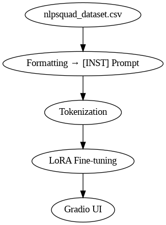
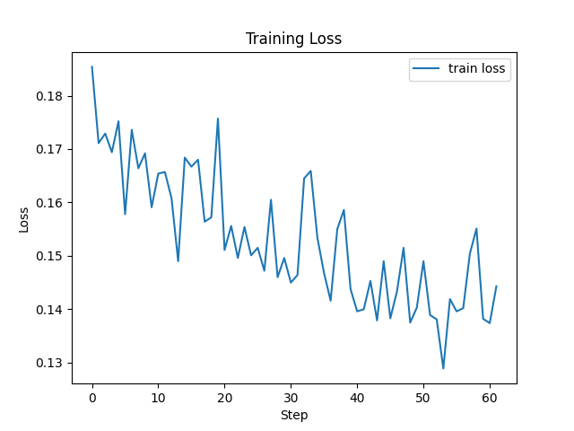
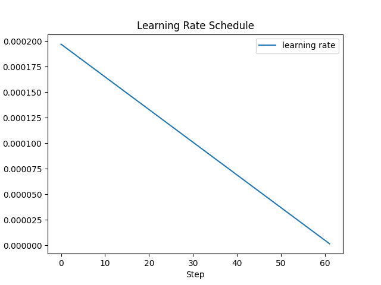

# qwen-medical-CHATBOT
This project focuses on building a lightweight, domain-specific medical chatbot by fine-tuning the Qwen2.5-0.5B-Instruct language model using LoRA (Low-Rank Adaptation). The training is done on a custom instruction-response dataset based on healthcare and alternative medicine. The model is optimized for memory efficiency using 4-bit quantization and deployed through an interactive Gradio interface. It offers medically relevant, instruction-following responses and is designed for real-time chatbot applications in resource-constrained environments like Google Colab.

## Hugging face spaces
A fine-tuned chatbot built on top of [Qwen-med-CHATBOT](https://huggingface.co/spaces/PrepStation201/medical-chat-bot) using LoRA (Low-Rank Adaptation), tailored for answering health-related and alternative medicine queries. This project combines lightweight training with real-time chatbot deployment using Gradio.


## 📌 Table of Contents

- [Features](#features)
- [Model Architecture](#model-architecture)
- [Dataset](#dataset)
- [Before vs After Fine-Tuning](#before-vs-after-fine-tuning)
- [Training Visualizations](#training-visualizations)
- [Running Locally](#running-locally)
- [Live Demo](#live-demo)
- [Technologies Used](#technologies-used)
- [Project Directory Structure](#project-directory-structure)
- [License](#license)

---

## ✅ Features

- 🏥 Fine-tuned on a custom medical instruction-response dataset
- 🔄 Efficient LoRA training (only ~0.5–1% of parameters trained)
- 💾 4-bit quantized model for low memory usage
- 🌐 Gradio-based chatbot for web interaction
- 📈 Integrated logging with TensorBoard
- 🧪 Before-vs-after output comparison for evaluation

---

## 🧠 Model Architecture




- **Base Model**: `Qwen2.5-0.5B-Instruct`
- **Adaptation**: LoRA via `peft`
- **Training**: Hugging Face `transformers` + `trl`

---

## 📁 Dataset

The dataset `nlpsquad_dataset.csv` contains approximately 1,600 high-quality instruction-response pairs in the healthcare domain.

Each row contains:
- `Instruction`: a natural language question (e.g., "What are herbal remedies for anxiety?")
- `Response`: a short, factual medical explanation

> ✅ Data was formatted as:
> ```
> <s>[INST] Instruction [/INST] Response </s>
> ```

---

## 🧪 Before vs After Fine-Tuning

See [comparison_outputs.md](comparison_outputs.md) for full samples.

| Prompt                             | Base Model Output        | Fine-Tuned Output                                       |
|------------------------------------|--------------------------|---------------------------------------------------------|
| What are remedies for migraines?   | I don't know.            | Ginger, peppermint oil, magnesium, and riboflavin...   |
| How does Ayurveda treat insomnia?  | No response.             | Ayurveda recommends ashwagandha and calming herbs...    |

---

## 📊 Training Visualizations

- 📉 Loss Curve  
  

- 📈 Learning Rate Schedule  
  

- 📊 Instruction Length Distribution  
  

Logged via TensorBoard and Matplotlib during training.

---

## 💻 Running Locally

> Prerequisite: Python 3.10+ and pip installed

1. Clone this repo:
   ```bash
   git clone https://github.com/yourusername/qwen-medical-chatbot.git
   cd qwen-medical-chatbot

```
