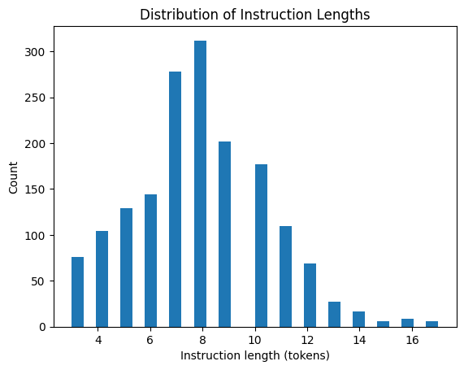

# 🧠 Qwen Medical Chatbot

This project focuses on building a lightweight, domain-specific medical chatbot by fine-tuning the Qwen2.5-0.5B-Instruct language model using LoRA (Low-Rank Adaptation). It leverages a custom instruction-response dataset built around health, wellness, and alternative medicine to teach the model how to answer medically relevant queries in natural language. The final model is memory-efficient, using 4-bit quantization, and is deployed through a Gradio-powered web interface for real-time interaction.

---

## 🤖 Hosted on Hugging Face Spaces
A live demo is hosted on Hugging Face Spaces:
👉 [Try it now](https://huggingface.co/spaces/PrepStation201/medical-chat-bot)

This space integrates the fine-tuned model with an interactive web-based chatbot, allowing users to ask medical questions and receive informative responses in real time.

---

## 📌 Table of Contents

- [Features](#features)
- [Model Architecture](#model-architecture)
- [Dataset](#dataset)
- [Before vs After Fine-Tuning](#before-vs-after-fine-tuning)
- [Training Visualizations](#training-visualizations)
- [Running Locally](#running-locally)
- [Live Demo](#live-demo)
- [Technologies Used](#technologies-used)
- [Project Directory Structure](#project-directory-structure)
- [License](#license)

---

## ✅ Features

- 🏥 Fine-tuned on a curated dataset targeting healthcare and alternative medicine topics
- ⚙️ LoRA-based training that reduces compute cost and training time
- 💾 Supports 4-bit quantization for low-resource environments (e.g., Google Colab)
- 🌍 Web interface using Gradio for public-facing chat interaction
- 📈 Tracks performance with integrated TensorBoard logging
- 🔍 Demonstrates measurable improvement over base model with before/after examples
- 📦 Clean project structure ready for GitHub and Hugging Face deployment

---

## 🧠 Model Architecture

```
CSV Dataset → Prompt Formatting → Tokenization → LoRA Fine-Tuning → Gradio Deployment
```


- **Base Model**: [Qwen2.5-0.5B-Instruct](https://huggingface.co/Qwen/Qwen2.5-0.5B-Instruct)
- **Fine-Tuning Technique**: Parameter-efficient LoRA adaptation using the PEFT library
- **Training Library**: Hugging Face `transformers`, `trl`, and `accelerate`
- **Deployment**: Web chatbot built using Gradio

---

## 📁 Dataset

This chatbot was trained on a custom-built CSV file named `nlpsquad_dataset.csv`. It contains ~1,600 high-quality instruction-response pairs inspired by reliable sources such as Gale Encyclopedia of Alternative Medicine.

Each entry includes:
- `Instruction`: A natural language query (e.g., "What are the symptoms of stress?")
- `Response`: A concise and medically relevant answer (e.g., "Common symptoms include fatigue, irritability, insomnia...")

The dataset is formatted using instruction-tuning style prompts:
```text
<s>[INST] user question [/INST] assistant response </s>
```

This format aligns with what the Qwen model expects for instruction-following tasks.

---

## 🧪 Before vs After Fine-Tuning

See [comparison_outputs.md](comparison_outputs.md) for a full side-by-side comparison of responses.

| Prompt                             | Base Model Output        | Fine-Tuned Output                                       |
|------------------------------------|--------------------------|---------------------------------------------------------|
| What are remedies for migraines?   | I don't know.            | Ginger, peppermint oil, magnesium, and riboflavin...   |
| How does Ayurveda treat insomnia?  | No response.             | Ayurveda recommends ashwagandha and calming herbs...    |
| What vitamins help reduce fatigue? | No answer.               | B-complex, iron, and magnesium are commonly used...     |

---

## 📊 Training Visualizations

The training process was monitored using TensorBoard and Matplotlib:

- 📉 **Loss Curve** - model performance over training steps
  

- 📈 **Learning Rate Schedule** - gradual warm-up and decay
  

- 📊 **Instruction Length Histogram** - token length distribution in training data
  

These graphs help assess training stability, overfitting risk, and data consistency.

---

## 💻 Running Locally

> Requirements: Python 3.10+, pip, and a GPU (optional)

1. Clone the repository:
```bash
git clone https://github.com/yourusername/qwen-medical-chatbot.git
cd qwen-medical-chatbot
```

2. Install the dependencies:
```bash
pip install -r requirements.txt
```

3. Launch the Gradio chatbot:
```bash
python app.py
```

> ✅ You can now ask health-related questions directly through your browser.

---

## 🌐 Live Demo

👉 [Click here to try the chatbot on Hugging Face Spaces](https://huggingface.co/spaces/PrepStation201/medical-chat-bot)

This version runs using the `adapter_model.safetensors` via LoRA and the base Qwen2.5 model for efficient public access.

---

## 🧰 Technologies Used

| Tool             | Purpose                                              |
|------------------|------------------------------------------------------|
| 🤗 Transformers   | Loading and managing pretrained language models      |
| 🧪 PEFT (LoRA)     | Lightweight fine-tuning strategy                     |
| 🧠 TRL             | Supervised fine-tuning trainer for instruction tasks |
| 📈 TensorBoard     | Real-time training metrics visualization             |
| 📊 Matplotlib      | Plotting and analysis of dataset & loss curves       |
| 🌐 Gradio          | Deploying chatbot with a web interface               |

---

## 📁 Project Directory Structure

```bash
qwen-medical-chatbot/
├── app.py
├── architecture.png
├── comparison_outputs.md
├── instr_length_hist.png
├── loss_curve.png
├── lr_curve.png
├── qwen_medical_finetuned/
├── nlpsquad_dataset.csv
├── requirements.txt
├── README.md
├── LICENSE
└── .gitignore
```

---

## 📄 License

This project is licensed under the MIT License. See the [LICENSE](LICENSE) file for full details.

```
